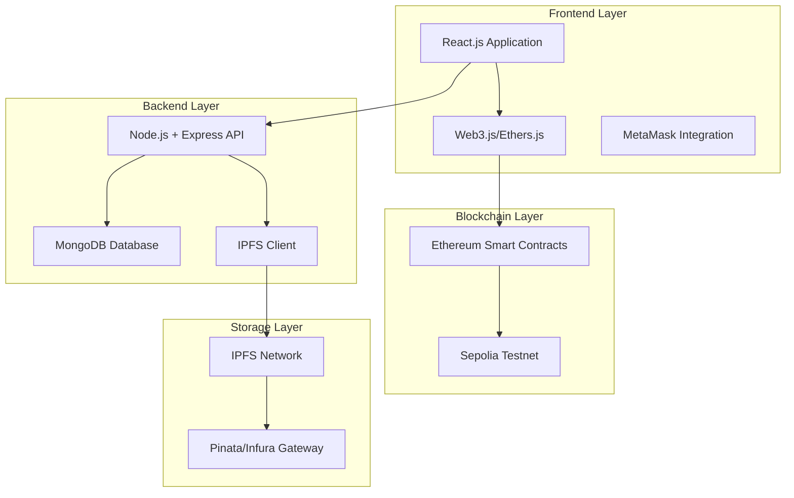
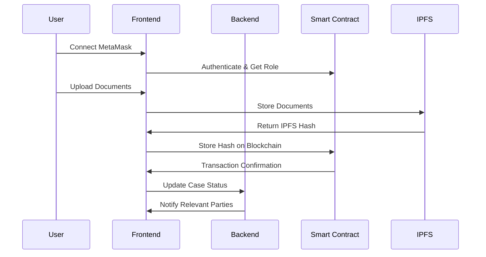

# Design Document

## Overview

Bhoomi Setu is a decentralized land registry system built on Ethereum blockchain with IPFS for document storage. The system follows a three-tier architecture with a React frontend, Node.js backend, and Solidity smart contracts. The design emphasizes security, transparency, and user experience while maintaining blockchain immutability for land ownership records.

## Architecture

### High-Level Architecture



### System Flow



## Components and Interfaces

### Smart Contract Architecture

#### LandRegistry.sol
```solidity
contract LandRegistry {
    struct LandRecord {
        uint256 landId;
        address currentOwner;
        string ipfsHash;
        uint256 registrationDate;
        bool isActive;
    }
    
    struct TransferRequest {
        uint256 requestId;
        uint256 landId;
        address from;
        address to;
        address inspector;
        TransferStatus status;
        string documentsHash;
        string inspectionReportHash;
    }
    
    enum TransferStatus { Pending, InspectionScheduled, Inspected, Approved, Rejected, Completed }
    enum UserRole { User, Inspector, Admin }
    
    mapping(address => UserRole) public userRoles;
    mapping(uint256 => LandRecord) public landRecords;
    mapping(uint256 => TransferRequest) public transferRequests;
    
    event LandRegistered(uint256 indexed landId, address indexed owner);
    event TransferRequested(uint256 indexed requestId, uint256 indexed landId);
    event TransferApproved(uint256 indexed requestId, address indexed newOwner);
    event CertificateIssued(uint256 indexed landId, string certificateHash);
}
```

#### AccessControl.sol
```solidity
contract AccessControl {
    modifier onlyAdmin() {
        require(userRoles[msg.sender] == UserRole.Admin, "Admin access required");
        _;
    }
    
    modifier onlyInspector() {
        require(userRoles[msg.sender] == UserRole.Inspector, "Inspector access required");
        _;
    }
    
    modifier onlyUser() {
        require(userRoles[msg.sender] == UserRole.User, "User access required");
        _;
    }
}
```

### Frontend Components

#### Authentication Module
- **MetaMaskConnector**: Handles wallet connection and authentication
- **RoleProvider**: Context provider for user role management
- **ProtectedRoute**: Route protection based on user roles

#### Dashboard Components
- **UserDashboard**: Property management, transfer requests, certificates
- **InspectorDashboard**: Assigned cases, inspection reports, site visits
- **AdminDashboard**: System overview, approvals, user management

#### Document Management
- **DocumentUploader**: IPFS upload with progress tracking
- **DocumentViewer**: Display documents from IPFS with verification
- **CertificateGenerator**: PDF generation with blockchain verification

### Backend API Design

#### Authentication Endpoints
```javascript
POST /api/auth/verify-wallet
GET /api/auth/user-role
POST /api/auth/update-profile
```

#### Land Management Endpoints
```javascript
GET /api/lands/user/:address
POST /api/lands/register
GET /api/lands/:landId/history
POST /api/lands/:landId/transfer-request
```

#### Inspector Endpoints
```javascript
GET /api/inspector/assigned-cases
POST /api/inspector/schedule-visit
POST /api/inspector/submit-report
PUT /api/inspector/case/:caseId/status
```

#### Admin Endpoints
```javascript
GET /api/admin/pending-approvals
POST /api/admin/approve-transfer
POST /api/admin/reject-transfer
GET /api/admin/system-analytics
POST /api/admin/assign-inspector
```

## Data Models

### MongoDB Collections

#### Users Collection
```javascript
{
  _id: ObjectId,
  walletAddress: String,
  role: String, // 'user', 'inspector', 'admin'
  profile: {
    name: String,
    email: String,
    phone: String,
    kycDocuments: {
      aadhaar: String, // IPFS hash
      pan: String, // IPFS hash
      verified: Boolean
    }
  },
  createdAt: Date,
  updatedAt: Date
}
```

#### Cases Collection
```javascript
{
  _id: ObjectId,
  requestId: Number, // From blockchain
  landId: Number,
  fromAddress: String,
  toAddress: String,
  inspectorAddress: String,
  status: String,
  documents: [{
    type: String,
    ipfsHash: String,
    uploadedAt: Date
  }],
  inspectionReport: {
    ipfsHash: String,
    submittedAt: Date,
    recommendation: String
  },
  notifications: [{
    message: String,
    sentAt: Date,
    recipients: [String]
  }],
  createdAt: Date,
  updatedAt: Date
}
```

#### Certificates Collection
```javascript
{
  _id: ObjectId,
  landId: Number,
  ownerAddress: String,
  certificateHash: String, // IPFS hash of PDF
  blockchainTxHash: String,
  issuedAt: Date,
  metadata: {
    landArea: String,
    location: String,
    surveyNumber: String
  }
}
```

### IPFS Document Structure

#### Property Documents
```json
{
  "documentType": "property_deed",
  "landId": "12345",
  "owner": "0x...",
  "metadata": {
    "area": "1000 sq ft",
    "location": "Mumbai, Maharashtra",
    "surveyNumber": "123/4A"
  },
  "files": [
    {
      "name": "deed.pdf",
      "hash": "QmX...",
      "size": 1024000
    }
  ],
  "timestamp": "2024-01-15T10:30:00Z"
}
```

## Error Handling

### Blockchain Error Handling
- **Gas Estimation Failures**: Provide gas estimation with buffer and user confirmation
- **Transaction Failures**: Implement retry mechanisms with exponential backoff
- **Network Congestion**: Queue transactions and provide status updates
- **Insufficient Funds**: Clear error messages with funding instructions

### IPFS Error Handling
- **Upload Failures**: Retry with different gateways, fallback to local node
- **Retrieval Failures**: Multiple gateway attempts, cached fallbacks
- **Large File Handling**: Chunking for files >100MB, progress indicators
- **Network Issues**: Offline detection, queue operations for retry

### Application Error Handling
- **Authentication Failures**: Clear MetaMask connection instructions
- **Role Authorization**: Redirect to appropriate dashboards with error messages
- **Form Validation**: Real-time validation with helpful error messages
- **API Failures**: Graceful degradation, offline mode indicators

## Testing Strategy

### Smart Contract Testing
```javascript
// Using Hardhat and Chai
describe("LandRegistry", function() {
  it("Should register new land", async function() {
    const tx = await landRegistry.registerLand(ipfsHash);
    expect(tx).to.emit(landRegistry, "LandRegistered");
  });
  
  it("Should handle transfer requests", async function() {
    await landRegistry.requestTransfer(landId, newOwner);
    const request = await landRegistry.transferRequests(0);
    expect(request.status).to.equal(0); // Pending
  });
});
```

### Frontend Testing
- **Unit Tests**: Jest + React Testing Library for components
- **Integration Tests**: Cypress for user workflows
- **Web3 Testing**: Mock MetaMask interactions
- **Accessibility Tests**: axe-core integration

### Backend Testing
- **API Tests**: Supertest for endpoint testing
- **Database Tests**: MongoDB Memory Server for isolated tests
- **IPFS Tests**: Mock IPFS client for reliable testing
- **Authentication Tests**: JWT and wallet signature verification

### End-to-End Testing
```javascript
// Cypress test example
describe("Land Transfer Flow", () => {
  it("Should complete full transfer process", () => {
    cy.connectMetaMask();
    cy.uploadDocuments();
    cy.requestTransfer();
    cy.switchRole("inspector");
    cy.submitInspectionReport();
    cy.switchRole("admin");
    cy.approveTransfer();
    cy.verifyCertificateIssued();
  });
});
```

### Performance Testing
- **Load Testing**: Artillery.js for API endpoints
- **Blockchain Performance**: Gas optimization analysis
- **IPFS Performance**: Upload/download speed benchmarks
- **Frontend Performance**: Lighthouse CI integration

## Security Considerations

### Smart Contract Security
- **Access Control**: Role-based permissions with OpenZeppelin
- **Reentrancy Protection**: ReentrancyGuard for state-changing functions
- **Input Validation**: Comprehensive parameter validation
- **Upgrade Patterns**: Proxy contracts for future upgrades

### Web3 Security
- **Signature Verification**: Proper message signing and verification
- **Transaction Security**: User confirmation for all blockchain operations
- **Private Key Protection**: Never store private keys, MetaMask only
- **Contract Interaction**: Whitelist approved contract addresses

### API Security
- **Authentication**: JWT tokens with wallet signature verification
- **Rate Limiting**: Express-rate-limit for API protection
- **Input Sanitization**: Joi validation for all inputs
- **CORS Configuration**: Strict origin policies

### Data Security
- **Encryption**: AES-256 for sensitive off-chain data
- **IPFS Security**: Content addressing for integrity verification
- **Database Security**: MongoDB encryption at rest
- **Backup Strategy**: Automated backups with encryption

## Deployment Architecture

### Development Environment
- **Local Blockchain**: Hardhat network for development
- **Local IPFS**: IPFS daemon for document testing
- **Development Database**: Local MongoDB instance
- **Hot Reload**: React development server with Web3 mocking

### Staging Environment
- **Sepolia Testnet**: Ethereum testnet for contract testing
- **Pinata IPFS**: Managed IPFS service for reliability
- **MongoDB Atlas**: Cloud database with staging data
- **Vercel Preview**: Branch-based frontend deployments

### Production Environment
- **Ethereum Mainnet**: Production blockchain deployment
- **Infura IPFS**: Enterprise IPFS gateway
- **MongoDB Atlas**: Production cluster with replication
- **CDN Integration**: CloudFlare for global content delivery

### Monitoring and Analytics
- **Blockchain Monitoring**: Etherscan API for transaction tracking
- **Application Monitoring**: Sentry for error tracking
- **Performance Monitoring**: New Relic for API performance
- **User Analytics**: Privacy-focused analytics with Plausible