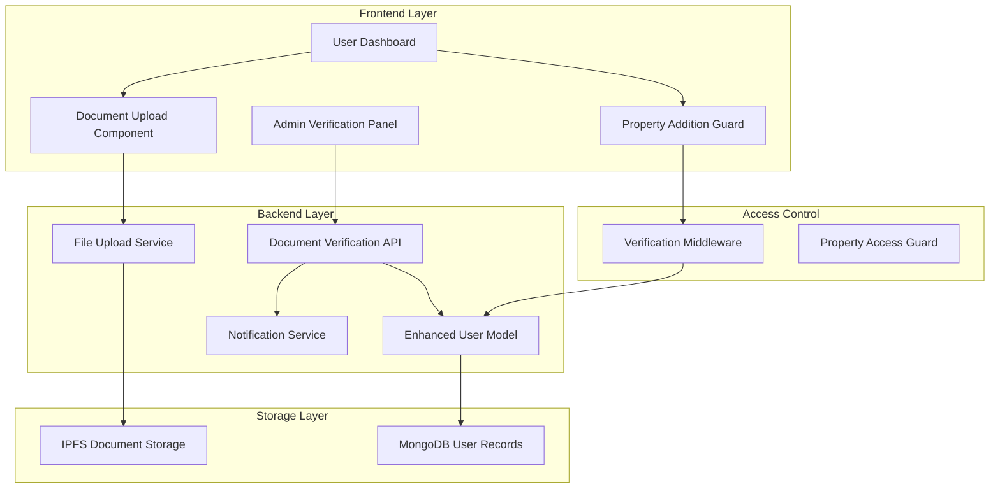
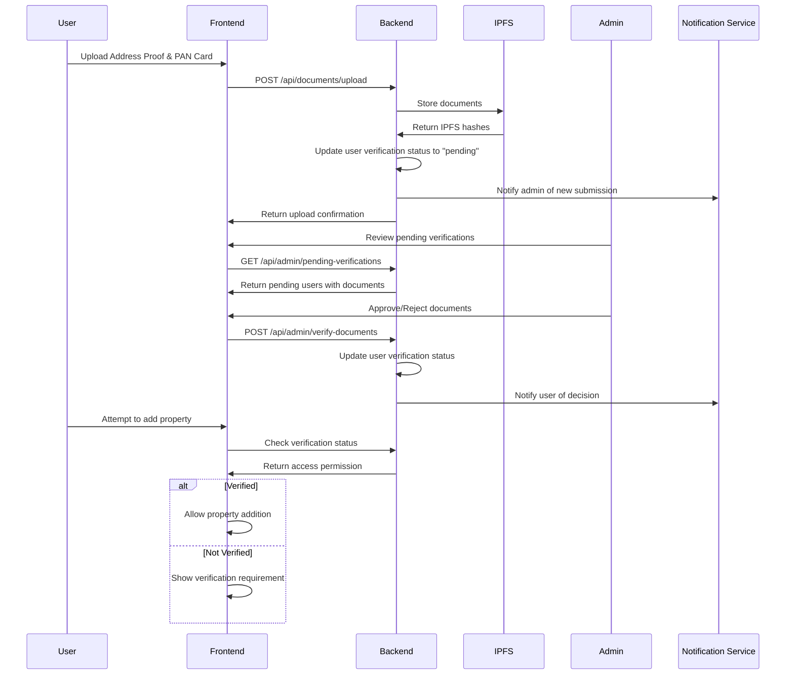

# Design Document

## Overview

The Document Verification and Property Access Control feature extends the existing Bhoomi Setu system by implementing a mandatory document verification workflow. This design integrates seamlessly with the current User model and authentication system, adding verification status tracking and access control mechanisms. The feature ensures that users must upload and get approval for Address Proof and PAN Card documents before they can add properties to the system.

## Architecture

### System Integration Flow



### Document Verification Workflow



## Components and Interfaces

### Enhanced User Model

The existing User model will be extended to support the document verification workflow:

```typescript
// Extension to existing User model
export interface IUserDocumentVerification {
  verificationStatus: 'not_submitted' | 'pending' | 'approved' | 'rejected';
  documents: {
    addressProof: {
      ipfsHash?: string;
      fileName?: string;
      uploadedAt?: Date;
      fileType?: string;
      fileSize?: number;
    };
    panCard: {
      ipfsHash?: string;
      fileName?: string;
      uploadedAt?: Date;
      fileType?: string;
      fileSize?: number;
    };
  };
  verificationHistory: Array<{
    status: 'pending' | 'approved' | 'rejected';
    adminAddress?: string;
    adminName?: string;
    reason?: string;
    processedAt: Date;
    submissionId: string;
  }>;
  lastSubmissionAt?: Date;
  approvedAt?: Date;
  rejectedAt?: Date;
  rejectionReason?: string;
}
```

### Document Upload Service

```typescript
interface DocumentUploadService {
  uploadDocument(
    file: File, 
    documentType: 'addressProof' | 'panCard',
    userAddress: string
  ): Promise<{
    ipfsHash: string;
    fileName: string;
    fileSize: number;
    fileType: string;
  }>;
  
  validateDocument(file: File): Promise<{
    isValid: boolean;
    errors: string[];
  }>;
  
  getDocumentUrl(ipfsHash: string): string;
  
  deleteDocument(ipfsHash: string): Promise<boolean>;
}
```

### Verification Management Service

```typescript
interface VerificationService {
  submitForVerification(userAddress: string): Promise<{
    submissionId: string;
    estimatedReviewTime: string;
    queuePosition: number;
  }>;
  
  getPendingVerifications(
    page: number,
    limit: number
  ): Promise<{
    verifications: PendingVerification[];
    total: number;
    currentPage: number;
  }>;
  
  processVerification(
    userAddress: string,
    decision: 'approve' | 'reject',
    reason?: string,
    adminAddress: string
  ): Promise<void>;
  
  getVerificationStatus(userAddress: string): Promise<VerificationStatus>;
  
  getVerificationHistory(userAddress: string): Promise<VerificationHistory[]>;
}
```

### Access Control Middleware

```typescript
interface AccessControlMiddleware {
  requireDocumentVerification: (
    req: Request,
    res: Response,
    next: NextFunction
  ) => void;
  
  checkPropertyAdditionAccess: (
    req: Request,
    res: Response,
    next: NextFunction
  ) => void;
  
  requireVerificationStatus: (
    allowedStatuses: VerificationStatus[]
  ) => (req: Request, res: Response, next: NextFunction) => void;
}
```

## Data Models

### Enhanced User Schema Extension

```javascript
// Addition to existing User schema
const UserDocumentVerificationSchema = {
  verificationStatus: {
    type: String,
    enum: ['not_submitted', 'pending', 'approved', 'rejected'],
    default: 'not_submitted',
    index: true
  },
  documents: {
    addressProof: {
      ipfsHash: {
        type: String,
        match: /^Qm[a-zA-Z0-9]{44}$/
      },
      fileName: String,
      uploadedAt: Date,
      fileType: {
        type: String,
        enum: ['application/pdf', 'image/jpeg', 'image/png']
      },
      fileSize: {
        type: Number,
        max: 5242880 // 5MB in bytes
      }
    },
    panCard: {
      ipfsHash: {
        type: String,
        match: /^Qm[a-zA-Z0-9]{44}$/
      },
      fileName: String,
      uploadedAt: Date,
      fileType: {
        type: String,
        enum: ['application/pdf', 'image/jpeg', 'image/png']
      },
      fileSize: {
        type: Number,
        max: 5242880 // 5MB in bytes
      }
    }
  },
  verificationHistory: [{
    status: {
      type: String,
      enum: ['pending', 'approved', 'rejected'],
      required: true
    },
    adminAddress: {
      type: String,
      lowercase: true,
      match: /^0x[a-fA-F0-9]{40}$/
    },
    adminName: String,
    reason: String,
    processedAt: {
      type: Date,
      default: Date.now
    },
    submissionId: {
      type: String,
      required: true,
      unique: true
    }
  }],
  lastSubmissionAt: Date,
  approvedAt: Date,
  rejectedAt: Date,
  rejectionReason: String
};
```

### Verification Queue Collection

```javascript
const VerificationQueueSchema = new Schema({
  userAddress: {
    type: String,
    required: true,
    lowercase: true,
    match: /^0x[a-fA-F0-9]{40}$/,
    index: true
  },
  submissionId: {
    type: String,
    required: true,
    unique: true
  },
  submittedAt: {
    type: Date,
    default: Date.now,
    index: true
  },
  priority: {
    type: Number,
    default: 0,
    index: true
  },
  assignedAdmin: {
    type: String,
    lowercase: true,
    match: /^0x[a-fA-F0-9]{40}$/
  },
  assignedAt: Date,
  estimatedReviewTime: {
    type: Number, // in hours
    default: 24
  },
  status: {
    type: String,
    enum: ['queued', 'in_review', 'completed'],
    default: 'queued',
    index: true
  }
});
```

### Notification Schema Extension

```javascript
const DocumentVerificationNotificationSchema = {
  type: {
    type: String,
    enum: [
      'documents_uploaded',
      'verification_approved',
      'verification_rejected',
      'resubmission_required',
      'admin_queue_alert'
    ]
  },
  documentVerificationData: {
    submissionId: String,
    verificationStatus: String,
    rejectionReason: String,
    queuePosition: Number,
    estimatedReviewTime: String
  }
};
```

## API Design

### Document Upload Endpoints

```typescript
// POST /api/documents/upload
interface DocumentUploadRequest {
  documentType: 'addressProof' | 'panCard';
  file: File; // multipart/form-data
}

interface DocumentUploadResponse {
  success: boolean;
  data: {
    ipfsHash: string;
    fileName: string;
    fileSize: number;
    uploadedAt: string;
  };
  message: string;
}

// GET /api/documents/status
interface DocumentStatusResponse {
  verificationStatus: VerificationStatus;
  documents: {
    addressProof?: DocumentInfo;
    panCard?: DocumentInfo;
  };
  canAddProperty: boolean;
  nextSteps: string[];
}

// POST /api/documents/submit-for-verification
interface SubmitVerificationResponse {
  submissionId: string;
  queuePosition: number;
  estimatedReviewTime: string;
  message: string;
}
```

### Admin Verification Endpoints

```typescript
// GET /api/admin/pending-verifications
interface PendingVerificationsRequest {
  page?: number;
  limit?: number;
  sortBy?: 'submittedAt' | 'priority';
  sortOrder?: 'asc' | 'desc';
}

interface PendingVerificationsResponse {
  verifications: Array<{
    userAddress: string;
    userName?: string;
    submissionId: string;
    submittedAt: string;
    queuePosition: number;
    documents: {
      addressProof: DocumentInfo;
      panCard: DocumentInfo;
    };
    previousRejections: number;
  }>;
  pagination: {
    currentPage: number;
    totalPages: number;
    totalItems: number;
    hasNext: boolean;
    hasPrev: boolean;
  };
}

// POST /api/admin/process-verification
interface ProcessVerificationRequest {
  userAddress: string;
  decision: 'approve' | 'reject';
  reason?: string; // required for rejection
}

interface ProcessVerificationResponse {
  success: boolean;
  message: string;
  userNotified: boolean;
}

// GET /api/admin/verification-stats
interface VerificationStatsResponse {
  pending: number;
  approved: number;
  rejected: number;
  averageProcessingTime: number; // in hours
  dailyProcessed: number;
  weeklyProcessed: number;
}
```

### Property Access Control Endpoints

```typescript
// GET /api/properties/access-check
interface PropertyAccessResponse {
  canAddProperty: boolean;
  verificationStatus: VerificationStatus;
  blockedReason?: string;
  nextSteps?: string[];
}

// Middleware integration with existing property endpoints
// All property creation endpoints will include verification check
```

## Frontend Components

### Document Upload Component

```typescript
interface DocumentUploadProps {
  documentType: 'addressProof' | 'panCard';
  onUploadSuccess: (result: DocumentUploadResult) => void;
  onUploadError: (error: string) => void;
  existingDocument?: DocumentInfo;
}

const DocumentUpload: React.FC<DocumentUploadProps> = ({
  documentType,
  onUploadSuccess,
  onUploadError,
  existingDocument
}) => {
  // File validation, upload progress, drag-and-drop
  // Preview functionality, file replacement
  // Error handling and retry mechanisms
};
```

### Verification Status Dashboard

```typescript
interface VerificationStatusProps {
  userAddress: string;
  onStatusChange: (status: VerificationStatus) => void;
}

const VerificationStatusDashboard: React.FC<VerificationStatusProps> = ({
  userAddress,
  onStatusChange
}) => {
  // Status display with progress indicators
  // Document upload interface
  // History of submissions and decisions
  // Next steps guidance
};
```

### Admin Verification Panel

```typescript
interface AdminVerificationPanelProps {
  onVerificationProcessed: (result: ProcessVerificationResult) => void;
}

const AdminVerificationPanel: React.FC<AdminVerificationPanelProps> = ({
  onVerificationProcessed
}) => {
  // Queue management with sorting and filtering
  // Document viewer with zoom and download
  // Batch processing capabilities
  // Statistics and analytics dashboard
};
```

### Property Addition Guard

```typescript
interface PropertyAdditionGuardProps {
  children: React.ReactNode;
  fallback?: React.ReactNode;
}

const PropertyAdditionGuard: React.FC<PropertyAdditionGuardProps> = ({
  children,
  fallback
}) => {
  // Check verification status
  // Show appropriate UI based on status
  // Redirect to verification if needed
};
```

## Error Handling

### Document Upload Errors

```typescript
enum DocumentUploadError {
  FILE_TOO_LARGE = 'FILE_TOO_LARGE',
  INVALID_FILE_TYPE = 'INVALID_FILE_TYPE',
  IPFS_UPLOAD_FAILED = 'IPFS_UPLOAD_FAILED',
  DATABASE_UPDATE_FAILED = 'DATABASE_UPDATE_FAILED',
  DUPLICATE_UPLOAD = 'DUPLICATE_UPLOAD'
}

const handleDocumentUploadError = (error: DocumentUploadError) => {
  switch (error) {
    case DocumentUploadError.FILE_TOO_LARGE:
      return 'File size must be less than 5MB. Please compress or choose a different file.';
    case DocumentUploadError.INVALID_FILE_TYPE:
      return 'Only PDF, JPG, and PNG files are allowed.';
    case DocumentUploadError.IPFS_UPLOAD_FAILED:
      return 'Upload failed. Please check your connection and try again.';
    // ... other cases
  }
};
```

### Verification Process Errors

```typescript
enum VerificationError {
  MISSING_DOCUMENTS = 'MISSING_DOCUMENTS',
  ALREADY_VERIFIED = 'ALREADY_VERIFIED',
  ADMIN_NOT_AUTHORIZED = 'ADMIN_NOT_AUTHORIZED',
  INVALID_DECISION = 'INVALID_DECISION',
  USER_NOT_FOUND = 'USER_NOT_FOUND'
}

const handleVerificationError = (error: VerificationError) => {
  // Provide user-friendly error messages
  // Suggest corrective actions
  // Log errors for admin review
};
```

### Access Control Errors

```typescript
enum AccessControlError {
  VERIFICATION_REQUIRED = 'VERIFICATION_REQUIRED',
  VERIFICATION_PENDING = 'VERIFICATION_PENDING',
  VERIFICATION_REJECTED = 'VERIFICATION_REJECTED',
  DOCUMENTS_EXPIRED = 'DOCUMENTS_EXPIRED'
}

const handleAccessControlError = (error: AccessControlError) => {
  // Redirect to appropriate verification step
  // Show clear instructions for resolution
  // Provide contact information for support
};
```

## Testing Strategy

### Unit Tests

```typescript
// Document upload service tests
describe('DocumentUploadService', () => {
  it('should validate file types correctly', async () => {
    const validFile = new File(['content'], 'test.pdf', { type: 'application/pdf' });
    const result = await documentService.validateDocument(validFile);
    expect(result.isValid).toBe(true);
  });

  it('should reject files larger than 5MB', async () => {
    const largeFile = new File(['x'.repeat(6000000)], 'large.pdf', { type: 'application/pdf' });
    const result = await documentService.validateDocument(largeFile);
    expect(result.isValid).toBe(false);
    expect(result.errors).toContain('File size exceeds 5MB limit');
  });
});

// Verification service tests
describe('VerificationService', () => {
  it('should update user status on approval', async () => {
    await verificationService.processVerification(userAddress, 'approve', '', adminAddress);
    const user = await User.findOne({ walletAddress: userAddress });
    expect(user.verificationStatus).toBe('approved');
  });
});
```

### Integration Tests

```typescript
// API endpoint tests
describe('Document Verification API', () => {
  it('should upload document and update user status', async () => {
    const response = await request(app)
      .post('/api/documents/upload')
      .attach('file', 'test-files/sample-pan.pdf')
      .field('documentType', 'panCard')
      .set('Authorization', `Bearer ${userToken}`);
    
    expect(response.status).toBe(200);
    expect(response.body.data.ipfsHash).toBeDefined();
  });

  it('should prevent property addition for unverified users', async () => {
    const response = await request(app)
      .post('/api/properties')
      .send(propertyData)
      .set('Authorization', `Bearer ${unverifiedUserToken}`);
    
    expect(response.status).toBe(403);
    expect(response.body.error).toContain('verification required');
  });
});
```

### End-to-End Tests

```typescript
// Cypress tests for complete workflow
describe('Document Verification Workflow', () => {
  it('should complete full verification process', () => {
    cy.login(userWallet);
    cy.uploadDocument('addressProof', 'test-address-proof.pdf');
    cy.uploadDocument('panCard', 'test-pan-card.pdf');
    cy.submitForVerification();
    
    cy.loginAsAdmin();
    cy.reviewPendingVerification(userAddress);
    cy.approveVerification();
    
    cy.loginAsUser(userWallet);
    cy.verifyPropertyAdditionEnabled();
  });
});
```

## Security Considerations

### Document Security

- **File Validation**: Strict file type and size validation
- **Virus Scanning**: Integration with antivirus scanning before IPFS upload
- **Content Verification**: Basic OCR and content validation for document authenticity
- **Access Control**: Documents only accessible to user and authorized admins

### IPFS Security

- **Hash Verification**: Verify IPFS hash integrity on retrieval
- **Gateway Security**: Use trusted IPFS gateways with fallback options
- **Content Addressing**: Leverage IPFS content addressing for tamper detection
- **Pinning Strategy**: Ensure documents are pinned on multiple nodes

### Admin Security

- **Role Verification**: Multi-level admin role verification
- **Action Logging**: Comprehensive audit trail for all admin actions
- **Rate Limiting**: Prevent abuse of verification endpoints
- **Session Management**: Secure admin session handling

### Data Privacy

- **PII Protection**: Encrypt sensitive user data at rest
- **Document Retention**: Clear policies for document retention and deletion
- **Access Logging**: Log all document access for audit purposes
- **GDPR Compliance**: Support for data deletion requests

## Performance Considerations

### File Upload Optimization

- **Chunked Uploads**: Support for large file chunked uploads
- **Progress Tracking**: Real-time upload progress indicators
- **Compression**: Automatic image compression for large files
- **Caching**: Cache frequently accessed documents

### Database Optimization

- **Indexing**: Proper indexing for verification status queries
- **Query Optimization**: Efficient queries for admin dashboard
- **Connection Pooling**: Optimize database connections
- **Caching Layer**: Redis caching for frequently accessed data

### IPFS Performance

- **Gateway Selection**: Intelligent gateway selection based on performance
- **Preloading**: Preload documents for admin review
- **CDN Integration**: CDN caching for document delivery
- **Monitoring**: Monitor IPFS node performance and availability

## Deployment Considerations

### Environment Configuration

```typescript
interface DocumentVerificationConfig {
  maxFileSize: number; // 5MB default
  allowedFileTypes: string[];
  ipfsGateways: string[];
  adminNotificationThreshold: number;
  verificationQueueLimit: number;
  documentRetentionDays: number;
}
```

### Migration Strategy

1. **Database Migration**: Add new fields to existing User schema
2. **Backward Compatibility**: Ensure existing users can still access system
3. **Gradual Rollout**: Phase rollout to existing users
4. **Data Migration**: Migrate existing KYC documents to new structure

### Monitoring and Alerts

- **Queue Monitoring**: Alert when verification queue exceeds threshold
- **Upload Failures**: Monitor and alert on high upload failure rates
- **Admin Activity**: Track admin processing times and efficiency
- **System Health**: Monitor IPFS connectivity and performance